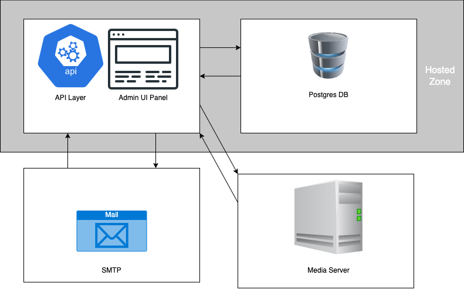
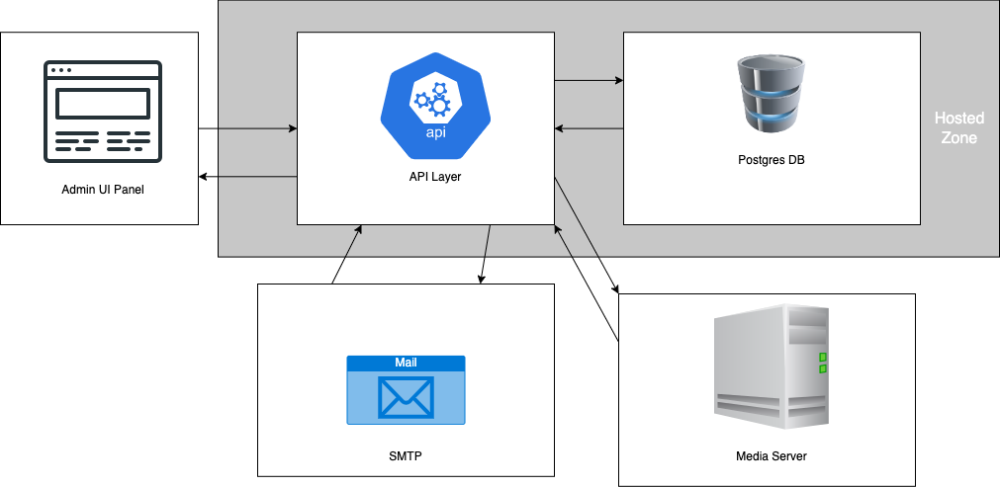

# Strapi Deployment


**Table of Contents**

* [Overview](#overview)
* [Prerequisites](#prerequisites)
* [Architecture Overview](#architecture-overview)
* [Environment Configuration](#environment-configuration)
* [Database Configuration](#database-configuration)
* [Server Configuration](#server-configuration)
* [Admin Configuration](#admin-configuration)


## Overview

In this tutorial we will create a deployment for our strapi application and also enable our project repo to push incremental updates via `git`.

**What we'll Learn:**

* Prep Strapi configuration for deployment
* Createa a Database and configure Strapi to use it in our deployment
* Examine the email plugin
* Deploy Strapi as a NodeJS server, which will serve the Admin UI panel.
* (Optional) Use third party service for media file storage
* (Optional) Deploy admin panel as a static site on different server node
* (Optional) Make infastructure resuable with IAC (infastructure as code)

> ### Warning!
> Be aware that by completing this tutorial using GCP, DigitalOcean or AWS, you may end up incurring charges on your credit card. Make sure to destroy the resources once you're finished.


## Prerequisites

**Create a Strapi project**
[How to create a Strapi project](https://docs.strapi.io/developer-docs/latest/getting-started/quick-start.html)
**Create a `git` repository**
1. Go to GitHub and create a new repo on your personal profile.
2. Either use an existing or new Strapi project, and [set the remote](https://docs.github.com/en/get-started/importing-your-projects-to-github/importing-source-code-to-github/adding-locally-hosted-code-to-github) in your local copy.
3. Push your code to the GitHub repository

## Architecture Overview

Generally for Strapi deployments there are two options:
* Serve admin and API on the same server
	

* Serve admin and API on two different servers (usually admin panel is a static site)
	

In the above two architectures, we also have a media server, database, and an SMTP server in the configurations as well.

Whichever design we choose, it's always a best practice to end up with a single configuration that can be flexible depending on the cloud provider or scenario. We achieve this by setting logical environment variables.

## Environment Configuration
In order to configure our Strapi application for deployment we first must modify the details in the `config` directory.

### How the Strapi environment configuration works.
* There are 'default' config files in the `config` directory.
* These files are what's currently being used in development. They also serve as the default configuration if no other file(s) overrides them, for example we could have multiple configurations for *staging*, *development*, *production*, etc.
* Different configurations are allowed by adding the `env` sub directory i.e. `config/env/staging`
* Each file in these environment configuraitons can override properties in the default config or even introduce new properties.
* Every property you DON'T override in an environement config will use the default values as a fallaback option

[Resource: Enviroment Configuration Docs](https://docs.strapi.io/developer-docs/latest/setup-deployment-guides/configurations/optional/environment.html#environment-configurations)

### Create Production Environment Configuration
1. Navigate to the `config` directory
2. Create a new directory tree like so: `./config/env/dev`. Below is an example using `bash`:
   ```
   cd config/
   mkdir -p env/dev
   cd env/dev
   ```

Next, we will re-create some of the files that already exist in `config/`, such as `admin.js`, `database.js`, etc. in order to override the defaults.

## Database Configuration

In the database configuration the two most important parameters for `database.js` are:
* `client`: essentially which type of database are we going to use to store the data e.g. `sqlite`, `postgres`, etc.
* `connection`: the type of connection details in order to connect to the `client`. The `connection` parameter contains information such as: `host`, `port`, `user`, `password`, etc.

Below is an example database configuration taken from the Strapi docs for `postgres`

```js
module.exports = ({ env }) => ({
  connection: {
    client: 'postgres',
    connection: {
      host: env('DATABASE_HOST', '127.0.0.1'),
      port: env.int('DATABASE_PORT', 5432),
      database: env('DATABASE_NAME', 'strapi'),
      user: env('DATABASE_USERNAME', 'strapi'),
      password: env('DATABASE_PASSWORD', 'strapi'),
      schema: env('DATABASE_SCHEMA', 'public'), // Not required
      ssl: {
        rejectUnauthorized: env.bool('DATABASE_SSL_SELF', false), // For self-signed certificates
      },
    },
    debug: false,
  },
});
```

### Create a new Database Configuration

1. Create a new `database.js` file in `dev/`
```js
touch ./config/env/dev/database.js
```

2. Copy this `database.js` example and paste it into the new file.
```js
module.exports = ({ env }) => ({
  connection: {
    client: 'postgres',
    connection: {
      host: env('DATABASE_HOST', '127.0.0.1'),
      port: env.int('DATABASE_PORT', 5432),
      database: env('DATABASE_NAME', 'strapi'),
      user: env('DATABASE_USERNAME', 'strapi'),
      password: env('DATABASE_PASSWORD', 'strapi'),
    },
    debug: false,
  },
});
```
3. Create a Postgres Database by following one of these guides:
   * AWS
   * GCP
   * DigitalOcean
   * Render.com
4. After you've provisioned your database:
   * enter the values for `host`, `port`, `database`, `user`, `password` in `database.js`
   * OR add them to environment variables in the root `.env` file of your project.

## Server Configuration

For the server configuration (`server.js`) there are three crucial variables we need to be aware of:
* `host`
* `port`
* `keys`

In particular the `keys` / `APP_KEYS` variable is important. 

Based on a [`koa-session npm`](https://github.com/koajs/session/blob/master/Readme.md), `APP_KEYS` determine if the session data (i.e. your individual user permissions/ID information) matches what was set when you first connected to the Strapi admin UI. Think of it in a similar manner as session cookie data while using your browser.

> #### Further explanation on session middleware and keys
> * [Strapi docs on keys]()
> * [Session Management blog](https://www.section.io/engineering-education/session-management-in-nodejs-using-expressjs-and-express-session/)

For now, we're going to leave `APP_KEYS` alone and instead focus on `host` and `port` in `server.js`.

A few things to take notes about:
* On `server.js` we need to set the URL of the Strapi server
* If our admin panel is on the same server, we need to ensure it's our root URL + a relative path like `/dashboard`.
* If our admin panel is on a separate server, we just use the root URL for that server.

Many deploy providers offer an external URL to use as an environment variable that gets injected into the application code during deployment. For example render.com has a variable called `RENDER_EXTERNAL_URL`, which can act as the absolute URL of the server.

```js
module.exports = ({env}) => ({
  url: env('RENDER_EXTERNAL_URL', '')
})
```

## Admin Configuration

The admin configuration is used when sending users a password-reset or password-confirmation link. Strapi needs to know where to point users in such cases. We use this same URL in the `admin.js` file, it can be set to a relative path such as `/dashboard`

```js
module.exports = ({ env }) => ({
  auth: {
    secret: env('ADMIN_JWT_SECRET'),
  },
  url: '/dashboard',
});

```