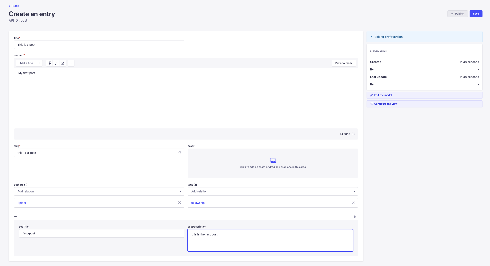

# Strapi Exercise

**Table of Contents**
1. [Overview](#overview)
1. [Designing Content](#designing-content-types)
   1. [Content Type Basics](#content-type-basics)
   1. [Relation Fields](#relation-fields)
   1. [Strapi Components](#strapi-components)
   1. [Content Manager](#content-manager)
1. [Challenges](#challenges)

## Overview

The benefits of using a headless CMS such as Strapi include:

* We can build our own data models from scratch rather than be confined by predefined types like in Wordpess. 
* Automatically generate CRUD functions and a REST/GraphQL API based on our custom data models.
* Uses `jwt` for a configurable authorization system, which means we can granularly control which content types are public vs. private
* Has a user authentication system that we can configure and leverage on our frontend client application
* Media server and Email server
* Deployable vs. Docker or NodeJS runtime
* Extensible via plugin API

## Designing Content Types

When designing our Strapi backend, it's important to think backwards from what our hypothetical frontend developers might wish to perform in terms of operations e.g. creating announcments, showing a new blog post, adding a new site header, etc.

For now it's best to think of our headless CMS as a way to properly *serve* content to the frontend all while giving content editors the ability to update / create content.

### Content Type Basics

Content types are essentially blueprints for your application's content. They model the entitites that will exist in your app. In Strapi there are generally two types:

* Collection Types: models content that will have multiple entries (e.g. blog posts and tags)
* Single Types: models content that will only have one entry (e.g. a static page like the home page)

**To create a `Post` collection type**:

1. Go to the admin panel and select Content-Type Builder

2. Under **User**, select + *Create new Collection Type*

3. Enter `post` (notice how the API ID automatically generates)

4. Select Advanced Settings, Enable Draft Publishing

> Draft publishing allows the content editors to publish draft posts before actually publishing them.
5. You can also choose to enable localization for your content, but you can always enable this later.
6. Select 'Continue'.
7. The next screen asks us what type of field / property that we want to associate with this collection type. Navigate to [this link](https://docs.strapi.io/user-docs/latest/content-types-builder/configuring-fields-content-type.html#regular-fields) for a quick overview of the data fields.
8. Considering that these collection types are blog posts, and will need multiple fields, select the following for now:
  * Text - for the `title` of the post
  * Rich Text - for the main body `content`
  * Media - for the `cover` image of the post
  * UID - for the `slug` name of the post to use in the URL
   > Example UID field
   > 
9. Populate the Collection type with the fields above. Here is an example of a post type when you're finished:
   
10. In the advanced settings make sure to set all fields as *Required field* and set `title` and `slug` as *Unique field*.
11. For the `slug` field, set the attached field to `title` so that we can autogenerate based on the relevant blog post title.
12. For the `cover` field, select multiple media in case we need to add a carousel of images. Also only select 'images' as the allowed type of media in the advanced settings.
13. We can also add two short text fields `seoTitle` and `seoDescription` to use later with Google Analytics.
14. Select **Finish**.
15. Select **Save** when you're finished.

### Relation Fields

There are other types of fields we can add that will come in handy later such as [Relational](https://docs.strapi.io/user-docs/latest/content-manager/managing-relational-fields.html) fields.

1. In your `Post` collection type, select **Add another filed to this collection type**
2. Create a *Relation* field type. Here's what the screen looks like:
   
3. You should see the Relation diagram appear, but wait! We currently don't have a **Tag** collection type to relate with the **Post** colleciton type. So first we need to create a new collection type called `tag`.
4. Cancel out and select *Create new colleciton type*
5. Enter `tag`, set draft publishing to *FALSE* in advanced settings
6. Select Continue.
7. For the data fields we will only have two, both set as required:
   * `name`: a short text field for the name of the tag. Also make sure to set this to Unique in advanced settings.
   * `slug`: a UID field which is attached to the `name` field.
8. Select **Save** when finished. Example of what it might look like:
   

Now we can use the `Tag` collection type with a relation data field type in the `Post` collection type.

1. Navigate back to the `Post` collection type
2. Select **Add another filed to this collection type**
3. Select **Relation** field type
4. Enter `tag` on the left-hand field, and select `post` as the collection type in the right-hand field.
5. Select **One to many** relationship because we want each post to potentially have multiple tags.
   * Example for "one to many" relationship for author field 
   * Example for "one to many" relationship for tags field 
6. Once you're happy with your `Post` collection type, select **Finish** and **Save**

In addition, we can also add an `author` field to our `Post` collection type. Follow the same steps above however select the **User (from: admin)** as the relation field, and select one to many authors for a single post to allow co-authoring.

> **Important Resources**
> * [Primer on relation field base relationship settings](https://strapi.io/blog/strapi-relations-101)
> * [Documentation on relations](https://docs.strapi.io/user-docs/latest/content-types-builder/configuring-fields-content-type.html#relation)

### Strapi Components

There is a way to improve our code reusability, in particular the two fields we have in our `Post` collection type: `seoTitle` and `seoDescription` will most likey be re-used in our home page and other future pages in the website. Strapi Components offers a way to abide by one of the core tenants of programming **DRY** i.e. "Don't Repeat Yourself".

If you need a re-usable field, consider using a **Component**. For this instance we will create an SEO component that includes the above fields.

**Creating the Component**

1. Remove / delete the existing `seoTitle` and `seoDescription` fields from the `Post` collection type.
2. Create a new field in `Post` collection type and select *Component*
3. Select *Create a new component*
4. Enter a display name: `seoInfo`
5. Create a new category called: `Seo`
6. Select *Continue*
7. The next step is to assign the component field to our `Post` collection type. Select:
  * Single Component
  * Enter Seo - seoInfo as component
  * Enter `seo` for Name.
  * Select 'Add first field to the component'
8. Add both `seoTitle` and `seoDescription`
9. Select Finish. Here is an example seo component:
   

The component should now appear in the left-hand side. There are use cases where we want to create a Single vs. a repeatable component.

For example, a testimonial section that has review description and an author text field can exist as a single component, but if we want more than one instance of this component like, say on a product page, it makes more sense to create this as a repeatable component.

### Content Manager

The content manager is a great way for non-technical users to manage and add content without knowing how the collection types were created. We already created two collection types: `post` and `tag`, so now we can add some tags we may need in the future.

1. Navigate to the Content Manager in the Strapi Dashboard
   
2. Select `tag` in the Content Manager
   
3. Select **+ Create new entry**
4. Add `fellowship` as the new entry and click the regenerate symbol in the slug tab to see if the entry is available. Example tag entry:
   
5. Select Save.
6. Now create our first post. Navigate to Post in content manager and select create new entry:
   
7. When the post screen appears in the content manager, you will notice that all the fields we previously created are here. Enter some placeholder content:
   * Add a `title`
   * Add `content`
   * Generate a `slug`
   * Add `seoTitle` and `seoDescription`
   * Add yourself as the `author`
   * Select the `fellowship` tag
8. Below is an example Post, select Save when done.
   
9. Now it's time to publish the post. We are currently editing in draft mode. If you select the edit icon, (pencil icon) Strapi gives the option to Publish next to the Save button.
   
   

## Challenges

The next steps in this journey is to try all or one of the following:

* Create a header and footer type
* Create a Home page
* Play with [Dynamic Zones](https://strapi.io/blog/how-to-create-pages-on-the-fly-with-dynamic-zone)